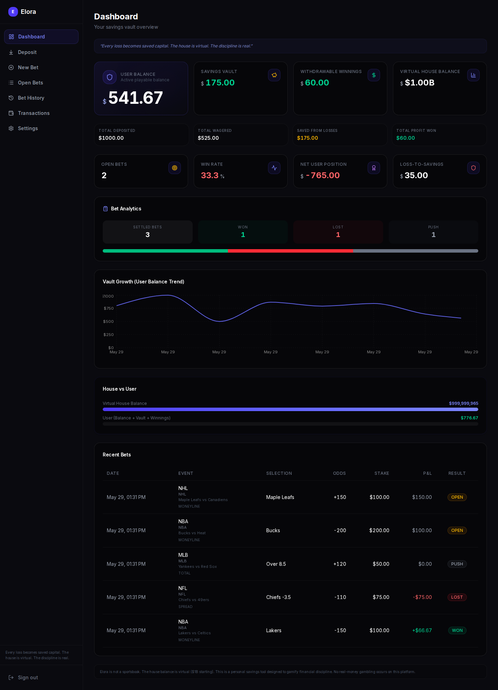
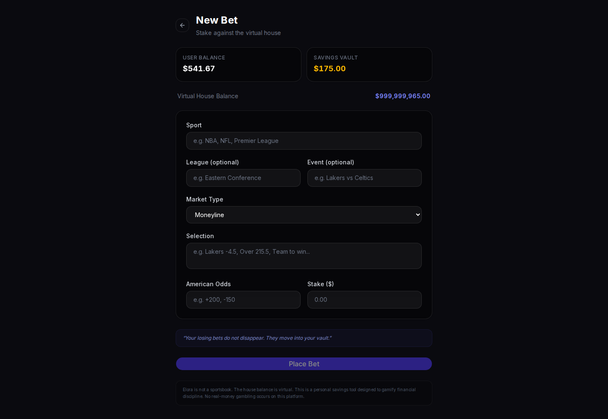
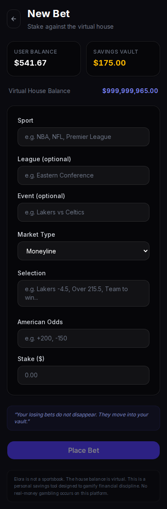
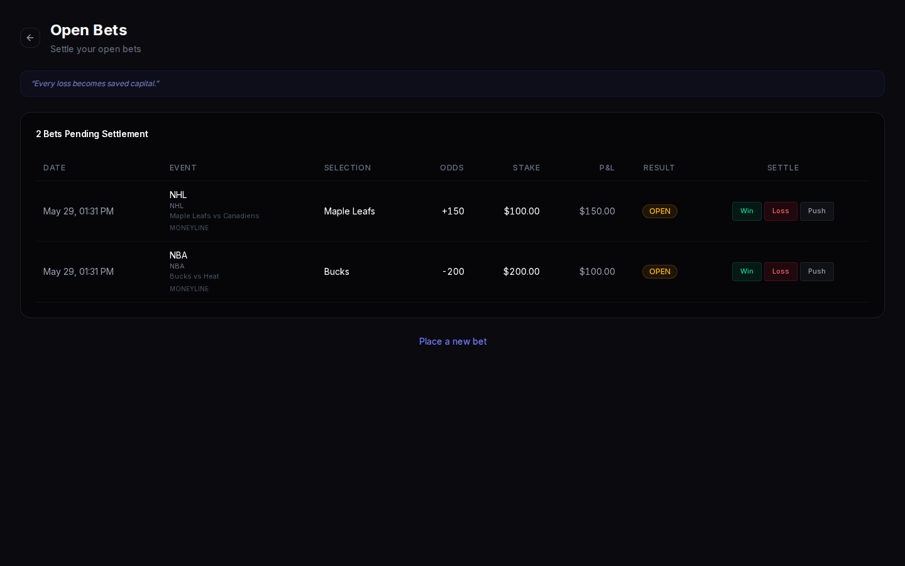
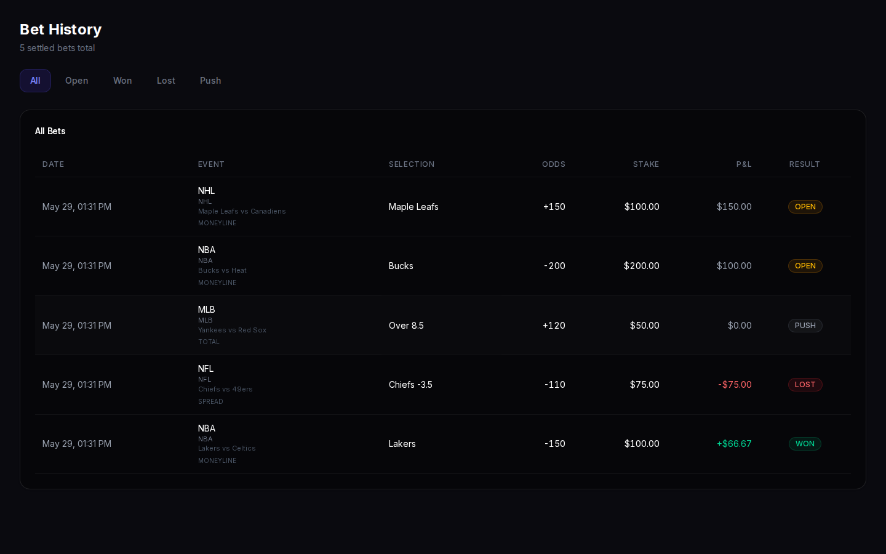

<div align="center">
  <br />

  

  <br /><br />

  <h1>Elora Vault</h1>
  <p>
    <em>A personal savings vault inspired by betting mechanics.</em>
  </p>

  <p>
    <strong>Every loss becomes stored capital.</strong><br />
    The house is virtual. The discipline is real.
  </p>

  <br />

  <div>
    
    
    
    
    
    
    
    
  </div>

  <br />

  <p>
    <a href="https://elora-bet-api.vercel.app" target="_blank"><strong>🌐 Live Demo →</strong></a>
    &nbsp;&nbsp;·&nbsp;&nbsp;
    <a href="#quick-start"><strong>⚡ Quick Start</strong></a>
    &nbsp;&nbsp;·&nbsp;&nbsp;
    <a href="#features"><strong>✨ Features</strong></a>
    &nbsp;&nbsp;·&nbsp;&nbsp;
    <a href="#screenshots"><strong>📸 Screenshots</strong></a>
    &nbsp;&nbsp;·&nbsp;&nbsp;
    <a href="#architecture"><strong>🏗️ Architecture</strong></a>
  </p>

  <br />
</div>

---

## Quick Start

```bash
# Clone the repository
git clone https://github.com/sparshsam/elora-bet-api.git
cd elora-bet-api

# Install dependencies
npm install

# Configure environment
cp .env.example .env.local
# Edit .env.local with your Supabase credentials

# Push database schema and start
npx prisma db push
npm run dev
```

Open [http://localhost:3000](http://localhost:3000) — done.

> **Prerequisites:** Node.js 22+, a [Supabase](https://supabase.com/) free-tier project, and npm.

---

## What is Elora Vault?

Elora Vault is a **personal savings vault inspired by betting mechanics** — NOT a real sportsbook.

The "house" is a virtual opponent with a starting balance of **$1,000,000,000** — displayed purely for personal tracking and behavioral feedback. When you "lose" a bet, your stake doesn't disappear — it moves into your savings vault. When you win, your profit grows your withdrawable winnings.

**Think of it as gamified discipline.** Every bet you make either grows your winnings or builds your savings. There is no real gambling, no real-money wagering, and no third-party betting.

### What Elora Vault IS

- ✅ A personal savings tool with gamified mechanics
- ✅ A discipline tracker that turns losses into stored capital
- ✅ A virtual house opponent for behavioral feedback
- ✅ A way to practice bankroll management
- ✅ A fun, risk-free way to engage with betting mechanics

### What Elora Vault IS NOT

- ❌ NOT a sportsbook, casino, or gambling operator
- ❌ NOT a wagering platform or betting exchange
- ❌ NOT connected to any live odds or real events
- ❌ NOT a peer-to-peer betting system
- ❌ NOT a real-money financial product

---

## Screenshots

| Desktop | Mobile |
|---------|--------|
|  | — |
|  |  |
|  |  |
|  | — |
|  | — |

---

## Core Concept

| Event | What Happens |
|-------|-------------|
| **Deposit** | User Balance increases. Total Deposited tracks the lifetime amount. |
| **Place Bet** | Stake deducted from User Balance. Total Wagered increases. |
| **Win** | User gets stake + profit back. Withdrawable Winnings and Total Profit Won increase. Virtual House Balance decreases by profit. |
| **Loss** | Stake moves to Savings Vault. Total Saved From Losses increases. Virtual House Balance gains the stake. |
| **Push** | Stake returned to User Balance. No change to vault or house. |

### The Savings Vault Model

```
You bet $100 at +200 odds:

    WIN  →  You get $300 back ($100 stake + $200 profit)
             Virtual house loses $200

    LOSS →  Your $100 stake moves to Savings Vault
             Virtual house gains $100

    PUSH →  Your $100 stake is returned
             Nothing changes
```

### The Virtual $1B House

The virtual house starts with **$1,000,000,000**. This is:
- A **fictional baseline** for personal tracking
- A visual representation of how your decisions affect an "opponent"
- A behavioral feedback mechanism — see if you can "beat the house"

The house balance has **no real-world value**. It exists purely for:
1. **Gamification** — making savings feel like a challenge
2. **Visual feedback** — watching the house shrink as you win
3. **Risk perception** — understanding stake sizes relative to a large pool

---

## Feature List

| Feature | Status |
|---------|--------|
| **Savings Vault** — losing bets move stake into savings | ✅ v0.2 |
| **Virtual $1B House** — fictional opponent for tracking | ✅ v0.2 |
| **Live Preview** — see projections before committing a bet | ✅ v0.2 |
| **Win/Loss/Push Settlement** — correct math for all outcomes | ✅ v0.2 |
| **Dashboard** — cards, stats, house vs user comparison | ✅ v0.2 |
| **Bet History** — filterable with pagination | ✅ v0.2 |
| **Transaction History** — type-based icons, paginated | ✅ v0.2 |
| **Deposit** — simulated fund addition | ✅ v0.2 |
| **Settings** — account info + statistics overview | ✅ v0.2 |
| **Dark Mode** — glassmorphism, charcoal/black, premium feel | ✅ v0.2 |
| **Mobile Optimization** — responsive, touch targets, bottom nav | ✅ v0.3 |
| **Dashboard Analytics** — win/loss/push counts, vault chart | ✅ v0.3 |
| **Empty/Loading/Error States** — all pages | ✅ v0.3 |
| **SEO Metadata** — Open Graph + Twitter Cards | ✅ v0.3 |
| **Protected Capital (Vault Locking)** — lock savings for 7/30/90 days | ✅ v0.4 |
| **Vault Timeline** — chronological lock/release activity feed | ✅ v0.4 |
| **Auto-Unlock** — locks release automatically on expiry | ✅ v0.4 |
| **Lock Cards** — countdown timers with progress indicators | ✅ v0.4 |
| **Auto-Lock Losses** — optional automatic loss protection | ✅ v0.4 |
| _Web3 Layer (v0.5)_ | |
| **Wallet Connection** — RainbowKit, WalletConnect, MetaMask, Coinbase Wallet | ✅ v0.5 |
| **ProtectedVault Contract** — Solidity vault with OpenZeppelin | ✅ v0.5 |
| **Onchain Deposits** — deposit USDC to vault contract | ✅ v0.5 |
| **Onchain Locks** — timed vault locks enforced by smart contract | ✅ v0.5 |
| **Lock Release & Withdrawal** — unlock + withdraw after timer expires | ✅ v0.5 |
| **User Ownership Isolation** — each user's vault state is independent | ✅ v0.5 |
| **Base Network** — deployed to Base mainnet / Sepolia | ✅ v0.5 |
| **Vault Dashboard** — onchain balances, lock timeline, unlock countdowns | ✅ v0.5 |
| **Self-Custodied** — no pooled treasury, no admin withdrawals, no rehypothecation | ✅ v0.5 |

---

## Tech Stack

| Layer | Technology |
|-------|-----------|
| **Framework** | [Next.js 16](https://nextjs.org/) (App Router) |
| **Language** | TypeScript |
| **Styling** | [TailwindCSS v4](https://tailwindcss.com/) + [shadcn/ui](https://ui.shadcn.com/) (Base UI React) |
| **Database** | PostgreSQL via [Supabase](https://supabase.com/) |
| **ORM** | [Prisma](https://www.prisma.io/) |
| **Auth** | [Supabase Auth](https://supabase.com/auth) (SSR) |
| **State** | [Zustand](https://github.com/pmndrs/zustand) |
| **Animations** | [Framer Motion](https://www.framer.com/motion/) |
| **Charts** | [Recharts](https://recharts.org/) |
| **Icons** | [Lucide](https://lucide.dev/) |
| **Web3** | [wagmi](https://wagmi.sh/) + [viem](https://viem.sh/) + [RainbowKit](https://www.rainbowkit.com/) |
| **Smart Contracts** | [Solidity](https://soliditylang.org/) + [Foundry](https://book.getfoundry.sh/) |
| **Contracts Lib** | [OpenZeppelin](https://www.openzeppelin.com/contracts) |
| **Network** | Base (mainnet + Sepolia) |
| **Deploy** | [Vercel](https://vercel.com/) |

---

## Architecture

```
src/
├── app/
│   ├── api/
│   │   ├── wallet/          → GET (fetch), POST (deposit)
│   │   ├── wallet/transactions/ → GET (list with pagination)
│   │   ├── bets/            → GET (list), POST (create)
│   │   └── bets/[id]/settle → PATCH (WIN/LOSS/PUSH)
│   ├── auth/                → login, signup, callback
│   ├── dashboard/           → vault overview + analytics
│   ├── bets/                → new bet, open bets
│   ├── history/             → bet history with filters
│   ├── transactions/        → transaction history
│   ├── deposit/             → simulated deposit
│   ├── settings/            → account + stats
│   ├── page.tsx             → landing page
│   ├── layout.tsx           → root layout
│   └── globals.css          → global styles
├── components/
│   ├── bets/                → BetForm, BetTable
│   ├── dashboard/           → StatCard, HouseBalanceCard, BalanceChart
│   ├── layout/              → Sidebar, MobileNav
│   └── ui/                  → Card, Button (shadcn)
├── lib/
│   ├── supabase/            → client, server (SSR)
│   ├── liability.ts         → vault math engine
│   ├── prisma.ts            → Prisma client singleton
│   └── utils.ts             → cn() helper
├── store/
│   └── useWalletStore.ts    → Zustand wallet state
└── middleware.ts            → auth protection
```

---

## Database Models

### User
| Field | Type | Notes |
|-------|------|-------|
| id | String (cuid) | Primary key |
| email | String (unique) | |
| createdAt | DateTime | |
| updatedAt | DateTime | |

### Wallet
| Field | Type | Default | Notes |
|-------|------|---------|-------|
| id | String (cuid) | | Primary key |
| userId | String | | FK to User |
| user_balance | Float | 0 | Active playable funds |
| savings_vault | Float | 0 | Locked savings from losses |
| withdrawable_winnings | Float | 0 | Profits from winning bets |
| virtual_house_balance | Float | 1,000,000,000 | Virtual opponent's balance |
| total_deposited | Float | 0 | Lifetime deposits tracker |
| total_wagered | Float | 0 | Lifetime wagered tracker |
| total_saved_from_losses | Float | 0 | Lifetime savings from losses |
| total_profit_won | Float | 0 | Lifetime profit tracker |

### Bet
| Field | Type | Notes |
|-------|------|-------|
| id | String (cuid) | Primary key |
| userId | String | FK to User |
| sport | String | e.g. "NBA", "NFL" |
| league | String? | e.g. "Eastern Conference" |
| event_name | String? | e.g. "Lakers vs Celtics" |
| marketType | Enum (MONEYLINE/SPREAD/TOTAL) | |
| selection | String | e.g. "Lakers -4.5" |
| odds | Int | American odds (+200, -150) |
| stake | Float | Amount wagered |
| potentialProfit | Float | Calculated at creation |
| potential_return | Float | Stake + profit |
| status | Enum (OPEN/WON/LOST/PUSH) | |
| settledAt | DateTime? | When settled |
| *balance tracking | Float? | Before/after snapshots |

### Transaction
| Field | Type | Notes |
|-------|------|-------|
| id | String (cuid) | Primary key |
| userId | String | FK to User |
| type | Enum (DEPOSIT/BET_PLACED/WIN_PROFIT/LOSS_TO_SAVINGS/PUSH_RETURN/WITHDRAWAL) | |
| amount | Float | Transaction amount |
| balanceBefore | Float | User balance snapshot |
| balanceAfter | Float | User balance snapshot |
| betId | String? | FK to Bet (if applicable) |
| description | String | Human-readable description |

---

## Local Development

### Prerequisites

- Node.js 22+
- A [Supabase](https://supabase.com/) project (free tier works)
- npm

### Setup

```bash
# Clone
git clone https://github.com/sparshsam/elora-bet-api.git
cd elora-bet-api

# Install dependencies
npm install

# Copy environment variables
cp .env.example .env.local
# Edit .env.local with your Supabase credentials

# Push database schema to Supabase
npx prisma db push

# Start development server
npm run dev
```

Open [http://localhost:3000](http://localhost:3000) in your browser.

### Environment Variables

| Variable | Description |
|----------|-------------|
| `DATABASE_URL` | Supabase connection string (with PgBouncer) |
| `DIRECT_URL` | Supabase direct connection string |
| `NEXT_PUBLIC_SUPABASE_URL` | Your Supabase project URL |
| `NEXT_PUBLIC_SUPABASE_ANON_KEY` | Supabase anonymous API key |
| `SUPABASE_SERVICE_ROLE_KEY` | Supabase service role key |
| `NEXT_PUBLIC_SITE_URL` | Site URL for auth redirects |
| `NEXT_PUBLIC_WALLETCONNECT_PROJECT_ID` | WalletConnect project ID (get at cloud.walletconnect.com) |
| `NEXT_PUBLIC_BASE_RPC_URL` | Base mainnet RPC URL |
| `NEXT_PUBLIC_BASE_SEPOLIA_RPC_URL` | Base Sepolia RPC URL |

### Useful Commands

```bash
npm run dev          # Start development server
npm run build        # Production build
npm run start        # Start production server
npm run lint         # Run ESLint
npx prisma generate  # Generate Prisma client
npx prisma db push   # Push schema to database
```

---

## Smart Contracts

Elora Vault uses a [Foundry](https://book.getfoundry.sh/) project in `contracts/` for Solidity development.

### ProtectedVault

The core contract at `contracts/src/ProtectedVault.sol` is a self-custodied vault that:

- **Accepts USDC deposits** (Base native USDC, 6 decimals)
- **Creates timed locks** (min 1 day, max 365 days) with onchain enforcement
- **Releases locks** after unlock time expires
- **Withdraws funds** from released locks
- **Isolates user state** — each user's vault data is independent
- **Emits events** — `Deposited`, `LockCreated`, `LockReleased`, `Withdrawn`, `LockWithdrawn`

### Security

- Uses OpenZeppelin's `ReentrancyGuard` and `SafeERC20`
- No admin-controlled withdrawals
- No pooled treasury — user funds are isolated
- No rehypothecation or leverage
- Reverts on invalid operations (zero amounts, insufficient balance, unexpired locks)

### Deployment

```bash
# Navigate to contracts
cd contracts

# Build
forge build

# Test (22 tests, all passing)
forge test

# ⚠️ DEPLOY TO BASE SEPOLIA FIRST for testing
# Deploy to Base Sepolia
forge script script/DeployProtectedVault.s.sol \
  --rpc-url base_sepolia \
  --private-key $PRIVATE_KEY \
  --broadcast --verify

# Verify on Sepolia BaseScan:
# https://sepolia.basescan.org/address/<DEPLOYED_ADDRESS>

# Only after Sepolia testing is complete:
# Deploy to Base mainnet
forge script script/DeployProtectedVault.s.sol \
  --rpc-url base_mainnet \
  --private-key $PRIVATE_KEY \
  --broadcast --verify

# ⚠️ NEVER deploy to mainnet before full Sepolia testing.
```

### Architecture

```
contracts/
├── src/
│   └── ProtectedVault.sol    → Main vault contract
├── test/
│   └── ProtectedVault.t.sol  → 22 tests
├── script/
│   └── DeployProtectedVault.s.sol → Deployment script
├── lib/
│   ├── forge-std/            → Foundry standard library
│   └── openzeppelin-contracts/ → OpenZeppelin v5.6
├── foundry.toml              → Build config (Base RPC endpoints)
└── remappings.txt            → Solidity import remappings
```

---

## Web3 Frontend

The frontend integrates with Base via wagmi, viem, and RainbowKit.

### Components

| Component | Location | Purpose |
|-----------|----------|---------|
| `Web3Provider` | `src/lib/web3/providers.tsx` | Wagmi + RainbowKit provider |
| `ConnectWalletButton` | `src/components/web3/connect-wallet.tsx` | Wallet connect/disconnect |
| `WalletInfoCard` | `src/components/web3/wallet-card.tsx` | Connected wallet info + USDC balance |
| `VaultSummaryCard` | `src/components/web3/vault-summary.tsx` | Onchain vault balances |
| `VaultDepositForm` | `src/components/web3/vault-deposit.tsx` | USDC deposit to vault |
| `VaultLockForm` | `src/components/web3/vault-lock-form.tsx` | Create onchain locks |
| `VaultLocksCard` | `src/components/web3/vault-locks.tsx` | Active/withdrawn locks display |

### Hooks

| Hook | Purpose |
|------|---------|
| `useVaultDeposit()` | Deposit USDC to vault |
| `useCreateLock()` | Create a timed lock |
| `useReleaseLock()` | Release an expired lock |
| `useWithdrawLock()` | Withdraw from a released lock |
| `useWithdrawUnlocked()` | Withdraw all unlocked balance |
| `useVaultSummary()` | Get vault deposit/locked/withdrawn totals |
| `useVaultLocks()` | Get all vault locks for user |
| `useVaultStatus()` | Check if vault is deployed |

### Configuration

Update `src/lib/contracts/contracts.ts` with the deployed vault address:

```ts
export const CURRENT_CHAIN = CHAIN_CONFIG.baseMainnet;
// After deploy: update vaultAddress
```

---

## Deploy on Vercel

This project is designed for Vercel deployment with Supabase as the database.

1. Push your repo to GitHub
2. Connect it to [Vercel](https://vercel.com/)
3. Add all environment variables from `.env.example`
4. Deploy

Vercel will automatically:
- Build the Next.js application
- Set up the correct Node.js version
- Handle serverless function routing

---

## Disclaimer

> **Elora Vault is not a sportsbook, casino, gambling operator, or wagering platform.**
>
> It does not provide live odds, accept third-party bets, or facilitate peer-to-peer betting. The virtual house balance ($1,000,000,000 starting) is **fictional** and exists only for personal tracking and behavioral feedback. No real-money gambling occurs on this platform. All deposits, bets, and balances are simulated.
>
> This is a personal savings tool designed to gamify financial discipline.

---

## License

[GNU Affero General Public License v3.0](LICENSE) © 2026 Sparsham Sam

Elora Vault is free software: you can redistribute and modify it under the terms of the AGPL-3.0. Any networked instance must make its source code available to all users. See the [LICENSE](LICENSE) file for the full text.

---

<div align="center">
  <p>
    <strong>Every loss becomes saved capital.</strong>  
    <br />
    The house is virtual. The discipline is real.
  </p>
  <br />
  <p>
    <a href="https://elora-bet-api.vercel.app">Live Demo</a> ·
    <a href="CHANGELOG.md">Changelog</a> ·
    <a href="ROADMAP.md">Roadmap</a> ·
    <a href="SECURITY.md">Security</a> ·
    <a href="CONTRIBUTING.md">Contributing</a>
  </p>
</div>
