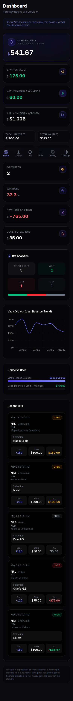

<div align="center">
  <br />
  <div>
    
    
    
  </div>
  <br />

  <h1>Elora — Personal Savings Vault</h1>
  <p>
    <strong>Every loss becomes saved capital. The house is virtual. The discipline is real.</strong>
  </p>
  <br />
  <a href="https://elora-bet-api.vercel.app" target="_blank">
    <strong>🌐 Live Demo →</strong>
  </a>
  <br />
  <br />
</div>

---

## What is Elora?

Elora is a **personal savings vault inspired by betting mechanics** — NOT a real sportsbook.

The "house" is a virtual opponent with a starting balance of **$1,000,000,000** — displayed purely for personal tracking and behavioral feedback. When you "lose" a bet, your stake doesn't disappear — it moves into your savings vault. When you win, your profit grows your withdrawable winnings.

**Think of it as gamified discipline.** Every bet you make either grows your winnings or builds your savings. There is no real gambling, no real-money wagering, and no third-party betting.

### What Elora IS

- ✅ A personal savings tool with gamified mechanics
- ✅ A discipline tracker that turns losses into stored capital
- ✅ A virtual house opponent for behavioral feedback
- ✅ A way to practice bankroll management
- ✅ A fun, risk-free way to engage with betting mechanics

### What Elora IS NOT

- ❌ NOT a sportsbook, casino, or gambling operator
- ❌ NOT a wagering platform or betting exchange
- ❌ NOT connected to any live odds or real events
- ❌ NOT a peer-to-peer betting system
- ❌ NOT a real-money financial product

---

## Screenshots

> 📸 Screenshots coming soon. See `assets/screenshots/README.md` for generation instructions.

<!--
| Desktop | Mobile |
|---------|--------|
|  |  |
|  |  |
|  | |
|  | |
-->

---

## Core Concept

| Event | What Happens |
|-------|-------------|
| **Deposit** | User Balance increases. Total Deposited tracks the lifetime amount. |
| **Place Bet** | Stake deducted from User Balance. Total Wagered increases. |
| **Win** | User gets stake + profit back. Withdrawable Winnings and Total Profit Won increase. Virtual House Balance decreases by profit. |
| **Loss** | Stake moves to Savings Vault. Total Saved From Losses increases. Virtual House Balance gains the stake. |
| **Push** | Stake returned to User Balance. No change to vault or house. |

### The Savings Vault Model

```
You bet $100 at +200 odds:

    WIN  →  You get $300 back ($100 stake + $200 profit)
             Virtual house loses $200

    LOSS →  Your $100 stake moves to Savings Vault
             Virtual house gains $100

    PUSH →  Your $100 stake is returned
             Nothing changes
```

### The Virtual $1B House

The virtual house starts with **$1,000,000,000**. This is:
- A **fictional baseline** for personal tracking
- A visual representation of how your decisions affect an "opponent"
- A behavioral feedback mechanism — see if you can "beat the house"

The house balance has **no real-world value**. It exists purely for:
1. **Gamification** — making savings feel like a challenge
2. **Visual feedback** — watching the house shrink as you win
3. **Risk perception** — understanding stake sizes relative to a large pool

---

## Feature List

| Feature | Status |
|---------|--------|
| Savings Vault — losing bets move stake into a locked vault | ✅ v0.2 |
| Virtual House — $1B starting opponent balance | ✅ v0.2 |
| Live Preview — see projected win/loss/vault before committing | ✅ v0.2 |
| Win/Loss/Push Settlement — correct balance math for all outcomes | ✅ v0.2 |
| Dashboard — primary cards, secondary stats, house vs user comparison | ✅ v0.2 |
| Bet History — filterable by status with pagination | ✅ v0.2 |
| Transaction History — type-based icons with pagination | ✅ v0.2 |
| Deposit — simulated fund addition with preset amounts | ✅ v0.2 |
| Settings — account info and statistics overview | ✅ v0.2 |
| Dark Mode — glassmorphism, charcoal/black/soft white | ✅ v0.2 |
| Mobile Optimization — responsive cards, touch targets, bottom nav | ✅ v0.3 |
| Dashboard Analytics — win/loss/push counts, vault growth chart | ✅ v0.3 |
| Empty/Loading/Error States — contextual messaging for all pages | ✅ v0.3 |
| SEO Metadata — Open Graph + Twitter Card tags | ✅ v0.3 |

---

## Tech Stack

| Layer | Technology |
|-------|-----------|
| **Framework** | [Next.js 16](https://nextjs.org/) (App Router) |
| **Language** | TypeScript |
| **Styling** | [TailwindCSS v4](https://tailwindcss.com/) + [shadcn/ui](https://ui.shadcn.com/) (Base UI React) |
| **Database** | PostgreSQL via [Supabase](https://supabase.com/) |
| **ORM** | [Prisma](https://www.prisma.io/) |
| **Auth** | [Supabase Auth](https://supabase.com/auth) (SSR) |
| **State** | [Zustand](https://github.com/pmndrs/zustand) |
| **Animations** | [Framer Motion](https://www.framer.com/motion/) |
| **Charts** | [Recharts](https://recharts.org/) |
| **Icons** | [Lucide](https://lucide.dev/) |
| **Deploy** | [Vercel](https://vercel.com/) |

---

## Architecture

```
src/
├── app/
│   ├── api/
│   │   ├── wallet/          → GET (fetch), POST (deposit)
│   │   ├── wallet/transactions/ → GET (list with pagination)
│   │   ├── bets/            → GET (list), POST (create)
│   │   └── bets/[id]/settle → PATCH (WIN/LOSS/PUSH)
│   ├── auth/                → login, signup, callback
│   ├── dashboard/           → vault overview + analytics
│   ├── bets/                → new bet, open bets
│   ├── history/             → bet history with filters
│   ├── transactions/        → transaction history
│   ├── deposit/             → simulated deposit
│   ├── settings/            → account + stats
│   ├── page.tsx             → landing page
│   ├── layout.tsx           → root layout
│   └── globals.css          → global styles
├── components/
│   ├── bets/                → BetForm, BetTable
│   ├── dashboard/           → StatCard, HouseBalanceCard, BalanceChart
│   ├── layout/              → Sidebar, MobileNav
│   └── ui/                  → Card, Button (shadcn)
├── lib/
│   ├── supabase/            → client, server (SSR)
│   ├── liability.ts         → vault math engine
│   ├── prisma.ts            → Prisma client singleton
│   └── utils.ts             → cn() helper
├── store/
│   └── useWalletStore.ts    → Zustand wallet state
└── middleware.ts            → auth protection
```

---

## Database Models

### User
| Field | Type | Notes |
|-------|------|-------|
| id | String (cuid) | Primary key |
| email | String (unique) | |
| createdAt | DateTime | |
| updatedAt | DateTime | |

### Wallet
| Field | Type | Default | Notes |
|-------|------|---------|-------|
| id | String (cuid) | | Primary key |
| userId | String | | FK to User |
| user_balance | Float | 0 | Active playable funds |
| savings_vault | Float | 0 | Locked savings from losses |
| withdrawable_winnings | Float | 0 | Profits from winning bets |
| virtual_house_balance | Float | 1,000,000,000 | Virtual opponent's balance |
| total_deposited | Float | 0 | Lifetime deposits tracker |
| total_wagered | Float | 0 | Lifetime wagered tracker |
| total_saved_from_losses | Float | 0 | Lifetime savings from losses |
| total_profit_won | Float | 0 | Lifetime profit tracker |

### Bet
| Field | Type | Notes |
|-------|------|-------|
| id | String (cuid) | Primary key |
| userId | String | FK to User |
| sport | String | e.g. "NBA", "NFL" |
| league | String? | e.g. "Eastern Conference" |
| event_name | String? | e.g. "Lakers vs Celtics" |
| marketType | Enum (MONEYLINE/SPREAD/TOTAL) | |
| selection | String | e.g. "Lakers -4.5" |
| odds | Int | American odds (+200, -150) |
| stake | Float | Amount wagered |
| potentialProfit | Float | Calculated at creation |
| potential_return | Float | Stake + profit |
| status | Enum (OPEN/WON/LOST/PUSH) | |
| settledAt | DateTime? | When settled |
| *balance tracking | Float? | Before/after snapshots |

### Transaction
| Field | Type | Notes |
|-------|------|-------|
| id | String (cuid) | Primary key |
| userId | String | FK to User |
| type | Enum (DEPOSIT/BET_PLACED/WIN_PROFIT/LOSS_TO_SAVINGS/PUSH_RETURN/WITHDRAWAL) | |
| amount | Float | Transaction amount |
| balanceBefore | Float | User balance snapshot |
| balanceAfter | Float | User balance snapshot |
| betId | String? | FK to Bet (if applicable) |
| description | String | Human-readable description |

---

## Local Development

### Prerequisites

- Node.js 22+
- A [Supabase](https://supabase.com/) project (free tier works)
- npm

### Setup

```bash
# Clone
git clone https://github.com/sparshsam/elora-bet-api.git
cd elora-bet-api

# Install dependencies
npm install

# Copy environment variables
cp .env.example .env.local
# Edit .env.local with your Supabase credentials

# Push database schema to Supabase
npx prisma db push

# Start development server
npm run dev
```

Open [http://localhost:3000](http://localhost:3000) in your browser.

### Environment Variables

| Variable | Description |
|----------|-------------|
| `DATABASE_URL` | Supabase connection string (with PgBouncer) |
| `DIRECT_URL` | Supabase direct connection string |
| `NEXT_PUBLIC_SUPABASE_URL` | Your Supabase project URL |
| `NEXT_PUBLIC_SUPABASE_ANON_KEY` | Supabase anonymous API key |
| `SUPABASE_SERVICE_ROLE_KEY` | Supabase service role key |
| `NEXT_PUBLIC_SITE_URL` | Site URL for auth redirects |

### Useful Commands

```bash
npm run dev          # Start development server
npm run build        # Production build
npm run start        # Start production server
npm run lint         # Run ESLint
npx prisma generate  # Generate Prisma client
npx prisma db push   # Push schema to database
```

---

## Deploy on Vercel

This project is designed for Vercel deployment with Supabase as the database.

1. Push your repo to GitHub
2. Connect it to [Vercel](https://vercel.com/)
3. Add all environment variables from `.env.example`
4. Deploy

Vercel will automatically:
- Build the Next.js application
- Set up the correct Node.js version
- Handle serverless function routing

---

## Disclaimer

> **Elora is not a sportsbook, casino, gambling operator, or wagering platform.**
>
> It does not provide live odds, accept third-party bets, or facilitate peer-to-peer betting. The virtual house balance ($1,000,000,000 starting) is **fictional** and exists only for personal tracking and behavioral feedback. No real-money gambling occurs on this platform. All deposits, bets, and balances are simulated.
>
> This is a personal savings tool designed to gamify financial discipline.

---

## License

[MIT](LICENSE) © 2026 Sparsham Sam

---

<div align="center">
  <p>
    <strong>Every loss becomes saved capital.</strong>  
    <br />
    The house is virtual. The discipline is real.
  </p>
  <br />
  <p>
    <a href="https://elora-bet-api.vercel.app">Live Demo</a> ·
    <a href="CHANGELOG.md">Changelog</a> ·
    <a href="ROADMAP.md">Roadmap</a> ·
    <a href="SECURITY.md">Security</a> ·
    <a href="CONTRIBUTING.md">Contributing</a>
  </p>
</div>
