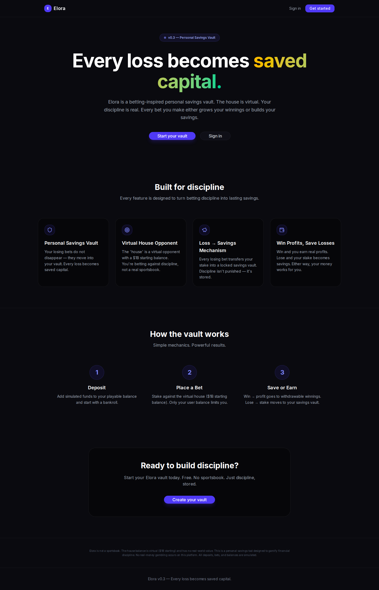

<div align="center">
  <br />

  

  <br /><br />

  <h1>Elora Vault</h1>
  <p>
    <em>Calm behavioral capital infrastructure on Base.</em>
  </p>

  <p>
    <strong>Protect your capital from yourself.</strong><br />
    Separate what is available now from what should be protected for later.
  </p>

  <br />

  <div>
    
    
    
    
    
    
    
    
  </div>

  <br />

  <p>
    <a href="https://elora-bet-api.vercel.app" target="_blank"><strong>Live Demo →</strong></a>
    &nbsp;&nbsp;·&nbsp;&nbsp;
    <a href="#quick-start"><strong>Quick Start</strong></a>
    &nbsp;&nbsp;·&nbsp;&nbsp;
    <a href="#features"><strong>Features</strong></a>
    &nbsp;&nbsp;·&nbsp;&nbsp;
    <a href="#architecture"><strong>Architecture</strong></a>
  </p>

  <br />
</div>

---

## What is Elora Vault?

Elora Vault is a **self-custodied behavioral capital vault built on Base**. It helps users separate capital that is available now from capital that should be protected for later.

The product is designed around one simple idea: not every dollar should feel equally available.

Elora is not a sportsbook, casino, prediction market, or gambling operator. It does not place wagers, provide odds, or connect to live events. Its prediction tools are a private bankroll-accounting layer: users can record decisions, commit capital, settle outcomes, and protect profits into timed horizons.

The mission is to grow Elora into a **fully Base-native behavioral capital app**: self-custodied, account-aware, low-friction, and quietly onchain. Base should become the invisible settlement and account layer beneath a calm financial interface — not the loudest part of the product.

### What Elora Vault IS

- A self-custodied USDC vault with timed protection horizons
- A calm capital-state system: Wallet, Available, Protected, Releasing, and Committed
- A private prediction/accounting layer for disciplined bankroll behavior
- A post-outcome protection system for preserving profit after volatile decisions
- A Base-native app with wallet connection, contract reads, and onchain vault actions
- Behavioral financial infrastructure designed to reduce impulsive capital movement
- A policy system for defining behavioral rules before emotion arrives
- A quiet evaluation layer that surfaces suggestions — no automatic fund movement

### What Elora Vault IS NOT

- Not a sportsbook, casino, or gambling operator
- Not a wagering platform, exchange, or odds provider
- Not connected to live odds or real event execution
- Not a custodial pooled treasury
- Not a DeFi yield dashboard or trading terminal
- Not an automated trading or execution system
- Not a replacement for professional financial advice

---

## Current Product Model

### Product State Flow

```
Capital State → Policy Runtime → Intent Suggestions → User Confirmation → Activity Memory
```

Every capital action flows through this pipeline:

1. **Capital State** — The canonical capital state engine tracks Wallet / Available / Protected / Releasing / Committed balances, derived from onchain contracts, wallet data, and the database.
2. **Policy Runtime** — Active user-defined policies are evaluated against current capital state and recent activity. The runtime produces structured suggestions with `requiresConfirmation: true`. No fund movement occurs during evaluation.
3. **Intent Suggestions** — Policy suggestions and protection opportunities converge on the Intent page, the signature decision surface. Users review, accept, snooze, or dismiss each suggestion.
4. **User Confirmation** — Every capital action (release, protect, withdraw) requires deliberate user confirmation. Confirmation modals include reflection countdowns and alternative actions.
5. **Activity Memory** — Completed actions are recorded in the transaction timeline. Policy lifecycle events appear alongside capital events for a unified history.

### Capital State Model

Elora separates money into two layers.

#### 1. Connected Wallet

External USDC held in the connected wallet. This money is outside Elora until deposited.

#### 2. Elora Capital

Capital deposited into Elora and represented across four states.

| State | Meaning |
|---|---|
| **Available** | Deposited capital available inside Elora. |
| **Protected** | Capital protected inside active horizons. |
| **Releasing** | Protected capital returning to availability. |
| **Committed** | Capital allocated to active predictions. |

The core accounting rule is:

```text
totalEloraCapital = available + protected + releasing + committed
```

External wallet balance is intentionally excluded from `totalEloraCapital`.

### Capital Flows

| Flow | Capital Movement |
|---|---|
| **Deposit** | Connected Wallet → Available |
| **Protect Capital** | Available → Protected |
| **Release Horizon** | Protected → Releasing → Available |
| **Log Prediction** | Available → Committed |
| **Prediction Won** | Committed → Available by total return |
| **Prediction Lost** | Committed decreases by stake |
| **Prediction Push** | Committed → Available by stake |
| **Protect Profit** | Available → Protected |
| **Withdraw** | Available → Connected Wallet |

---

## Product Surfaces

| Page | Purpose |
|---|---|
| **Vault** | Primary capital cockpit. Wallet balance, four capital states, deposit/withdraw/protect actions, active horizons. |
| **Policies** | Behavioral rule definitions — "Policy Studio." Create, edit, pause, and delete policies. Policy activity history. |
| **Sessions / Predictions** | Log predictions, commit capital, calculate potential return, settle outcomes, and protect profit. |
| **Activity** | Chronological record of deposits, protections, releases, withdrawals, prediction events, and policy lifecycle events. Unified capital memory. |
| **Intent** | Decision cockpit. Release confirmations, protection opportunities, policy runtime suggestions, completed horizons, and active protection timelines. |
| **Settings** | Account controls, Base Account lab card, Productive Protection research card. |

---

## Features

Elora is best understood by product layer, not as one flat checklist.

| Layer | Status |
|---|---|
| **Vault mechanics** | ✅ Production-built |
| **Behavioral separation** | ✅ Production-built |
| **Prediction routing** | ✅ Production-built |
| **Intent/release flows** | ✅ Production-built |
| **Policy engine + runtime** | ✅ Production-built (Foundation) |
| **Transaction lifecycle** | ✅ Production-built (hardened) |
| **Activity + policy event bridge** | ✅ Production-built |
| **Base-native capability detection** | ✅ Production-built (Foundation) |
| **Builder Code attribution** | ✅ Infrastructure-built (wired) |
| **Base Account development** | 🔬 Lab / Research |
| **Productive protection** | 🔬 Research-built |
| **Delayed liquidity** | 🔬 UX/model-built |

### Shipped Features

| Feature | Status |
|---|---|
| **Top-header Navigation** — Vault, Policies, Sessions, Activity, Intent | ✅ Live |
| **Wallet Connection** — RainbowKit, WalletConnect, MetaMask, Coinbase Wallet | ✅ Live |
| **Disconnect / Network Controls** — visible wallet actions in header | ✅ Live |
| **Base Sepolia Support** — wallet network checks and contract wiring | ✅ Live |
| **ProtectedVault Contract** — self-custodied timed USDC vault | ✅ Live |
| **Onchain Deposits** — USDC deposit flow with approval handling | ✅ Live |
| **Timed Horizons** — 7 / 30 / 90 / 180-day capital protection | ✅ Live |
| **Release Flow** — horizon release with Intent confirmation + countdown | ✅ Live |
| **Capital State Engine** — Wallet, Available, Protected, Releasing, Committed | ✅ Live |
| **Transaction Lifecycle Hardening** — submission, confirmation, replacement, error recovery | ✅ Live |
| **Prediction Logging** — description, type, odds, stake, calculated return | ✅ Live |
| **Prediction Settlement** — Won / Lost / Push accounting | ✅ Live |
| **Post-Win Protection** — protect profit or full return into a horizon | ✅ Live |
| **Activity Timeline** — unified capital + prediction + policy event feed | ✅ Live |
| **Policy Studio** — create, edit, pause, delete behavioral policies | ✅ Live |
| **Policy Runtime v1** — state-based evaluation, structured suggestions, no auto-execution | ✅ Live |
| **Activity + Policy Event Bridge** — policy lifecycle events (created, activated, paused) appear in Activity timeline via `/api/policies/activity` | ✅ Live |
| **Intent Decision Cockpit** — release confirmations, protection opportunities, policy suggestions, completed horizon summaries | ✅ Live |
| **Base Account Lab** — capability detection panel, SDK wrapper, diagnostics | 🔬 Lab |
| **Base-native Architecture** — EIP-5792 detection, account strategy types, transaction mode planning | 🔬 Lab-infra |
| **Builder Code Attribution** — production write hooks append dataSuffix; no-op fallback when unset | ✅ Wired |
| **Supabase Persistence** — users, wallet state, predictions, sessions, locks, transactions, policies | ✅ Live |
| **Responsive Layout** — desktop and mobile navigation | ✅ Live |
| **AGPLv3 License** — open-source distribution | ✅ Live |

### Research / Lab Surfaces

The following surfaces are intentionally staged as research or lab prototypes. They do not modify production wallet behavior, execute transactions, or affect capital movement:

| Surface | Status | Location |
|---|---|---|
| **Base Account SDK Lab** | Lab page with capability diagnostics, sub-account detection, and strategy tests | `/settings/base-account-lab` |
| **Transaction Orchestration Modes** | Conceptual execution modes documented for future architecture (direct, batched, sponsored, sub-account) | `src/lib/account/transaction-modes.ts` |
| **Productive Protection** | Conceptual protection modes (static, productive, conservative-yield, treasury, stable-lending) with yield strategy research definitions | `/settings/productive-protection`, `src/types/productive-protection.ts`, `src/lib/yield/yield-strategies.ts` |
| **Delayed Release UX** | Interactive mock flows for delayed, scheduled, staged, and reviewed release types — no onchain wiring | Intent page mock demos, `src/components/capital/delayed-release-mocks.tsx` |

---

## Layer Definitions

- **Production-built** means the layer exists in the running application with user-facing flows, persistence, and accounting behavior.
- **Production-built (Foundation)** means the layer has working production infrastructure but the full vision (e.g., execution wiring for policies) is intentionally staged.
- **Infrastructure-built (wired)** means the layer's code is fully wired into production flows and active when configured, but is invisible to users by design.
- **Research-built** means the product direction is documented and constrained, but no protocol integrations or execution logic exist in production.
- **UX/model-built** means the user-facing concept and capital model exist, even where the underlying mechanism is deliberately not wired.
- **Lab** means an isolated experimental surface that does not affect production flows.

---

## Policy System Overview

The policy system operates in two modes:

### State-Based Evaluation (Runtime v1)
- Evaluates active policies against current capital state and recent activity
- Triggered by page visits to `/api/policies/evaluate`
- Produces structured `PolicyRuntimeSuggestion` objects
- All suggestions have `requiresConfirmation: true`
- 30-minute cooldown per policy prevents suggestion spam

### Event-Driven Evaluation
- Evaluates policies against specific capital events (deposit, withdrawal, prediction settlement)
- Not yet wired to real-time event handlers — scheduled for future execution wiring

### Policy Types
1. **Protect profit percentage** — Automatically suggest protecting a portion of prediction returns
2. **Delayed withdrawal** — Cooling-off period before withdrawals complete
3. **Large transfer cooling** — Waiting period for deposits over a threshold
4. **Release reflection** — Reflection prompt before releasing protected capital
5. **Prediction profit protection** — Move profit into a timed protection horizon

**Key constraint:** The Policy Runtime evaluates and suggests. It does NOT execute. No funds move without user confirmation.

---

## Builder Code Attribution

Builder Code attribution is **wired into production transaction hooks**. The current state:

- **Helper exists** — `src/lib/account/builder-code.ts` provides `getBuilderDataSuffix()`, `hasBuilderCode()`, and `getRawBuilderCode()`
- **Production hooks append suffix** — All five production write calls (`approve`, `deposit`, `createLock`, `releaseLock`, `withdrawUnlocked`) include the Builder Code dataSuffix where configured
- **Fallback is no-op** — When `NEXT_PUBLIC_BASE_BUILDER_CODE` is unset, `getBuilderDataSuffix()` returns `"0x"` (zero-length hex) which viem treats as a no-op. Transactions execute identically with or without attribution
- **No ABI changes** — Attribution is an ERC-8021 data suffix appended to existing calldata. No smart contract changes required
- **No contract behavior changes** — The data suffix is informational metadata, not executable logic. It does not affect gas cost, security, or transaction flow

---

## Base Account Direction

Elora is intentionally moving toward quieter self-custody.

Today, the app uses external wallet infrastructure through RainbowKit, wagmi, and Base Sepolia wallet connections.

Long-term, Elora is being architected toward a Base Account model where:

- ownership remains self-custodied
- wallet friction is reduced
- protection flows become calmer and less technical
- onchain permanence exists underneath a simple interface

The goal is not to make users think about crypto more.
The goal is to let Base quietly handle ownership, settlement, and permanence beneath a calm behavioral capital system.

**Status:** The Base Account Lab at `/settings/base-account-lab` is a read-only research surface. It provides capability detection, SDK wrapper tests, and account relationship diagnostics. It does not replace the production wallet flow.

Key architecture files:

```text
src/lib/account/
├── account-strategy.ts         → Strategy types (external-wallet, base-account, elora-sub-account)
├── base-account-client.ts      → Isolated Base Account SDK wrapper (lab only)
├── builder-code.ts             → Builder Code attribution utility (production-wired)
├── transaction-modes.ts        → Research execution modes (direct, batched, sponsored, sub-account)
```

Architecture layers:

- **external-wallet** (active) — Current RainbowKit-based flow
- **base-account** (future) — Planned smart-wallet flow
- **elora-sub-account** (future) — Dedicated sub-account for vault operations

---

## Quick Start

```bash
# Clone the repository
git clone https://github.com/sparshsam/elora-vault.git
cd elora-vault

# Install dependencies
npm install

# Configure environment
cp .env.example .env.local
# Edit .env.local with Supabase, WalletConnect, and contract configuration

# Push database schema and start
npx prisma db push
npm run dev
```

Open [http://localhost:3000](http://localhost:3000).

> **Prerequisites:** Node.js 22+, npm, a Supabase project, WalletConnect project ID, and Base Sepolia-compatible wallet setup.

---

## Screenshots

| Surface | Screenshot |
|---|---|
| Landing | `assets/screenshots/screenshot-main.png` |
| Login | `assets/screenshots/login-desktop.png` |
| Sign Up | `assets/screenshots/signup-desktop.png` |

---

## Tech Stack

| Layer | Technology |
|---|---|
| **Framework** | Next.js 16 App Router |
| **Language** | TypeScript |
| **Styling** | TailwindCSS v4 + custom design tokens |
| **Database** | PostgreSQL via Supabase |
| **ORM** | Prisma |
| **Auth** | Supabase Auth SSR |
| **State** | Zustand + contract-derived hooks |
| **Web3** | wagmi + viem + RainbowKit |
| **Smart Contracts** | Solidity + Foundry |
| **Contracts Library** | OpenZeppelin |
| **Network** | Base Sepolia |
| **Deploy** | Vercel |

---

## Architecture

```text
src/
├── app/
│   ├── (authenticated)/
│   │   ├── vault/              → Capital state cockpit
│   │   ├── policies/           → Policy Studio (CRUD + activity)
│   │   ├── sessions/           → Prediction logging and settlement
│   │   ├── activity/           → Chronological capital memory
│   │   ├── intent/             → Decision cockpit (releases, protection, suggestions)
│   │   └── settings/           → Account controls + lab surfaces
│   ├── api/
│   │   ├── bets/               → Prediction create/list/protect/settle endpoints
│   │   ├── policies/           → Policy CRUD + activity + evaluate endpoints
│   │   ├── sessions/           → Session persistence endpoints
│   │   ├── onchain/            → Onchain event ingestion
│   │   ├── vault/              → Vault lock queries
│   │   └── wallet/             → Wallet state and transaction history
│   ├── auth/                   → Login, signup, callback
│   └── page.tsx                → Landing page
├── components/
│   ├── account/                → Capability diagnostics panel
│   ├── capital/                → Deposit, withdraw, protect, release modals
│   ├── layout/                 → Top header, mobile nav, page shell
│   ├── policies/               → PolicyCard, CreatePolicyModal, SummaryCard
│   ├── vault/                  → Capital state cards and horizon surfaces
│   └── wallet/                 → Wallet control components
├── contracts/                  → ProtectedVault Solidity contract
├── hooks/                      → EIP-5792 capability detection
├── lib/
│   ├── account/                → Strategy types, Base Account SDK, Builder Code, tx modes
│   ├── capital/                → Release windows, capital state model
│   ├── policies/               → Policy engine, evaluators, state machine, events, timeline, suggestions
│   ├── web3/                   → Contract read/write hooks, config, providers
│   ├── supabase/               → Client/server helpers
│   └── prisma.ts               → Prisma client singleton
├── store/                      → Zustand wallet store
├── types/
│   ├── policy.ts               → ProtectionPolicy, PolicyCondition, PolicyAction
│   ├── policy-orchestration.ts → Evaluation types, RuntimeSuggestion, TimelineEntry
│   └── productive-protection.ts → Productive protection conceptual types
└── middleware.ts               → Auth protection
```

---

## Design Philosophy

Elora is intentionally restrained.

The interface avoids sportsbook aesthetics, casino language, DeFi noise, and dopamine-driven financial UX. The design direction is warm stone, botanical green, soft borders, quiet typography, and clear financial state separation.

The product should feel less like a dashboard and more like a calm financial operating system.

---

## Security

Elora's security posture is documented in [`docs/security/current-security-state.md`](docs/security/current-security-state.md). That document covers:

- **Security philosophy** — self-custodied, non-custodial, explicit-confirmation oriented
- **Authentication & identity model** — Supabase Auth SSR, UUID-based user mapping, middleware-gated routes
- **Database security** — RLS on all user-data tables, owner-only access, service-role for backend flows only
- **Transaction safety model** — explicit wallet confirmations, wrong-network handling, lifecycle tracking, no silent execution
- **Builder Code attribution safety** — production-wired, no-op fallback when unset, no contract behavior changes
- **Base Account / smart wallet safety** — lab-scoped, capability detection before execution, sequential fallback always preserved
- **Secret handling rules** — pre-commit hooks, git history remediation, rotation requirements
- **Policy Runtime safety** — suggestions-only architecture, `requiresConfirmation: true` at the type level, no auto-execution
- **Infrastructure maturity snapshot** — RLS, Builder Code, Policy Runtime, activity ledger, transaction lifecycle, and research surfaces

Key operational guarantees:

- No automatic fund movement. All capital actions require deliberate user confirmation.
- No hidden automation, background jobs, cron-based execution, or autonomous agents move funds.
- No AI-driven capital management. Policy evaluation is deterministic and rules-based.
- No formal audit has been conducted — this is experimental software.

---

## Roadmap

### Near-term priorities

- Wire policy suggestions to vault operations (execution layer)
- Loss → onchain lock creation on ProtectedVault
- Prediction terminology migration ("Bet" → "Prediction" in API and DB)
- Richer horizon detail surfaces (individual cards, remaining duration, extension controls)
- Stronger empty states and first-run onboarding
- Wire delayed/scheduled/staged/reviewed release windows to onchain release logic
- Transition wallet UX toward Base Account / smart-wallet infrastructure
- Continue moving Elora toward a fully Base-native app architecture

### Future explorations

- Named horizons
- Longitudinal capital memory
- Quiet gas abstraction and sponsored protection flows
- Base-native account abstraction
- Base.dev ecosystem analytics and rewards participation
- Productive protected capital strategies
- Optional rules for automatic post-profit protection
- Yield strategies aligned with Elora's restraint-first philosophy

### Research-complete architecture (not yet wired)

- **Delayed release windows**: immediate, delayed, scheduled, staged, and reviewed release types
  → `src/lib/capital/release-windows.ts`
- **Productive protection modes**: static-protection, productive-protection, conservative-yield, treasury-style, stable-lending (conceptual, no protocol integration)
  → `src/types/productive-protection.ts`
- **Yield strategy definitions**: Aave USDC (Base), Morpho USDC (Base), reserve-style, treasury-style (research only, no execution)
  → `src/lib/yield/yield-strategies.ts`

---

## License

Elora Vault is licensed under the **GNU Affero General Public License v3.0**.

See [`LICENSE`](LICENSE) for details.

---

## Disclaimer

**Elora Vault is experimental software.** It is not financial advice, not a sportsbook, not a casino, not a gambling operator, not an exchange, and not a DeFi yield dashboard. The prediction logging system is private record-keeping only and does not place wagers or connect to live markets.

**Policy Runtime does not auto-execute capital movement.** All policy suggestions require explicit user confirmation. No funds move without a deliberate user action.

**Productive Protection is research-only.** No yield strategies, productive capital modes, or lending integrations are active in production. All related code is conceptual or research-defined.

**Base Account / transaction orchestration lab is read-only and research-only.** Lab surfaces at `/settings/base-account-lab` and `/settings/productive-protection` do not modify production wallet behavior, execute transactions, or affect capital movement unless explicitly stated otherwise.

Use testnet deployments carefully. Do not deposit funds you cannot afford to lose into experimental software.
